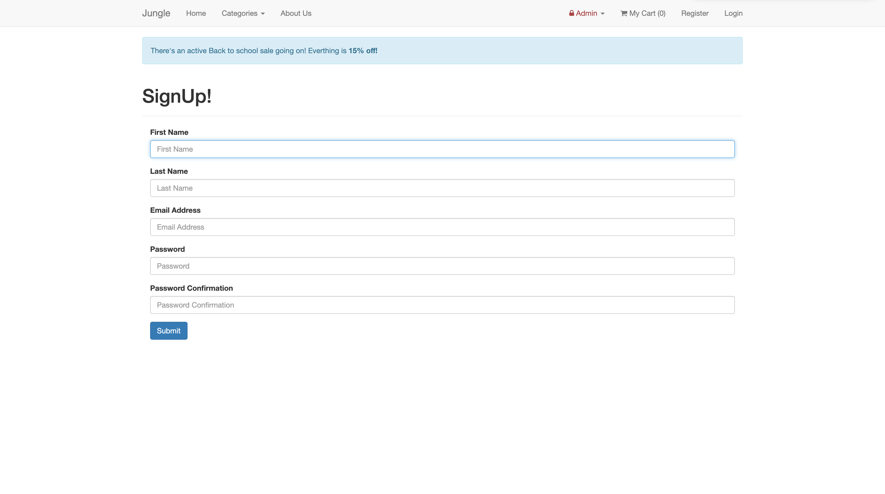
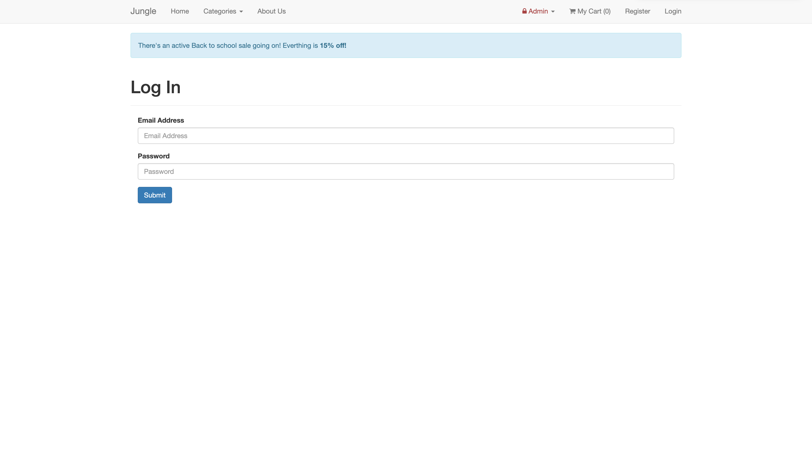
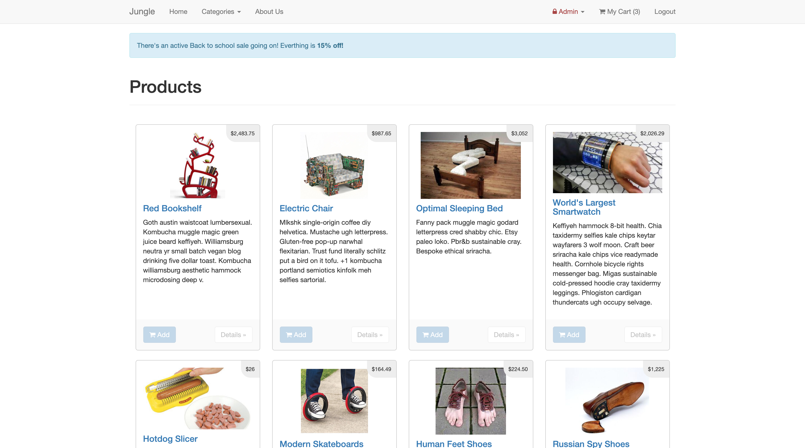
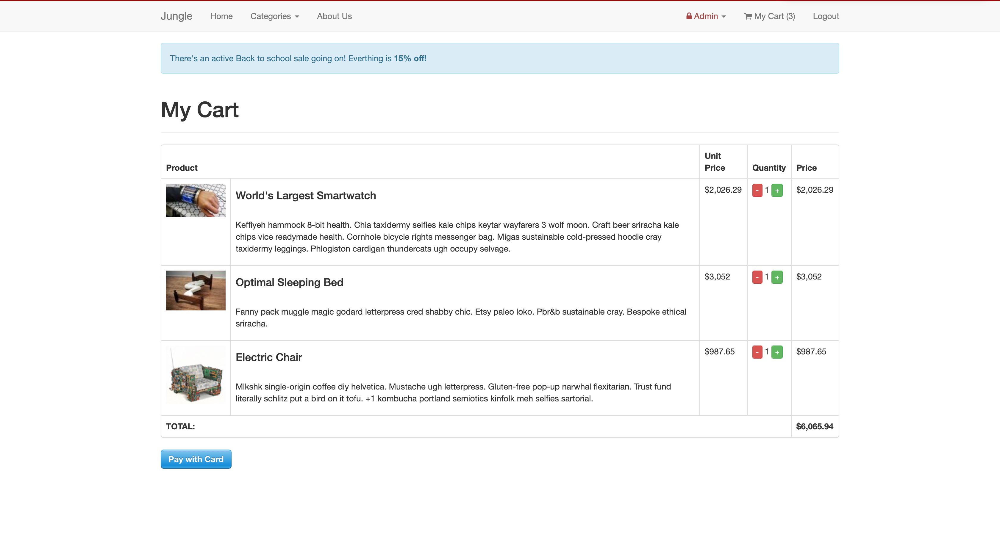
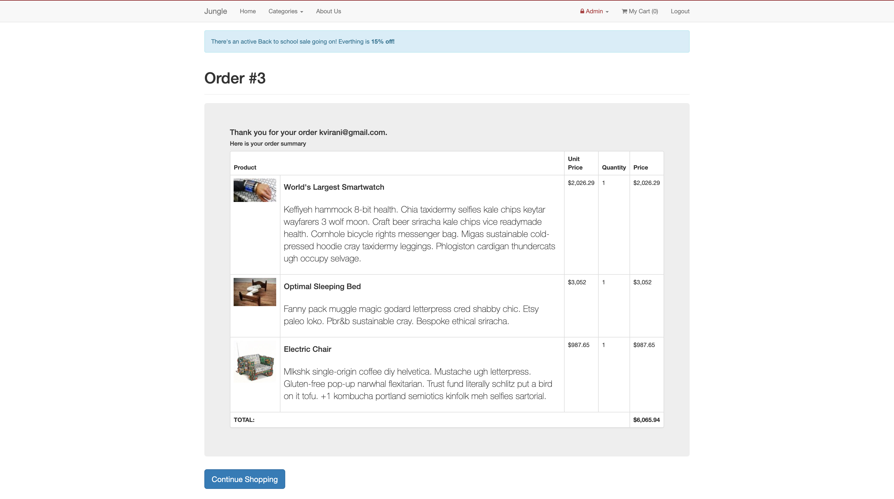

# Jungle

Inherited an existing app called Jungle (A mini e-commerce application built with Rails 4.2) and used existing code style and approach to fix occuring bugs and implement new features.

## Setup

1. Run `bundle install` to install dependencies
2. Create `config/database.yml` by copying `config/database.example.yml`
3. Create `config/secrets.yml` by copying `config/secrets.example.yml`
4. Run `bin/rake db:reset` to create, load and seed db
5. Create .env file based on .env.example
6. Sign up for a Stripe account
7. Put Stripe (test) keys into appropriate .env vars
8. Run `bin/rails server` to start the server

## Running Rspec and Capybara Test

```sh
bin/rspec
```

## Stripe Testing (Checkout Testing)

Use Credit Card `4111 1111 1111 1111` for testing success scenarios.

More information in their docs: <https://stripe.com/docs/testing#cards>

## Dependencies

- Rails 4.2.8 [Rails Guide](http://guides.rubyonrails.org/v4.2/)
- PostgreSQL 9.x
- Stripe

## Final Product

- Sign Up Page
  

- Log In Page
  

- Home Page
  

- Checkout Page
  

- Order Confirmation Page
  

## Current Functionalities

- When a product has 0 quantity, a sold out badge should be displayed on the product list page.
- Admin users can list and create new categories.
- Admins can add new products using the new category.
- A Visitor can go to the registration page from any page in order to create an account.
- A Visitor can can sign up for a user account with my e-mail, password, first name and last name.
- A Visitor can can sign in using my e-mail and password.
- A User can log out from any page.
- A User cannot sign up with an existing e-mail address.
